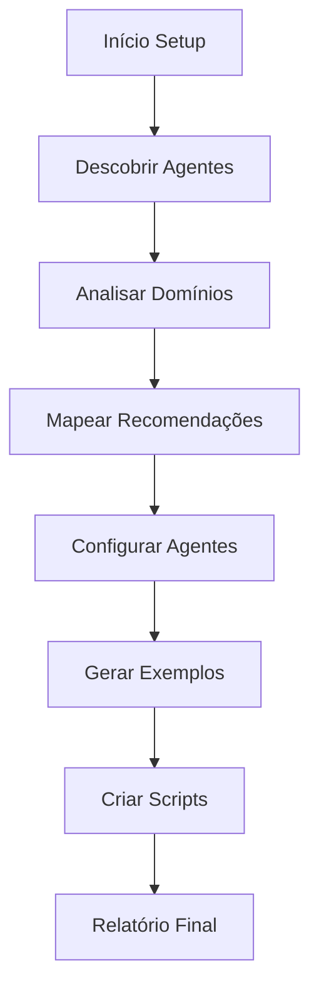

# 🔧 MCP MARKETPLACE - Especificação Técnica

## 📋 Especificação de Sistema

### Versão: 1.0.0
### Data: Janeiro 2025
### Baseado em: AutoGen MCP Official Docs + Victor Dibia Article

---

## 🏗️ Arquitetura Técnica

### Stack Tecnológico

| Componente | Tecnologia | Versão | Propósito |
|------------|------------|--------|-----------|
| **Backend Core** | Python | 3.8+ | Lógica principal do marketplace |
| **Interface** | Streamlit | Latest | Interface web interativa |
| **MCP Integration** | autogen-ext[mcp] | Latest | Integração com servidores MCP |
| **Agent Framework** | autogen-agentchat | Latest | Framework de agentes |
| **Data Processing** | Pandas | Latest | Manipulação de dados |
| **Configuration** | JSON | - | Persistência de configurações |

### Dependências do Sistema

```python
# Dependências mínimas (funcionalidade básica)
streamlit>=1.28.0
pandas>=2.0.0

# Dependências completas (funcionalidade MCP)
autogen-ext[mcp]>=0.4.0
autogen-agentchat>=0.2.0

# Dependências opcionais (servidores MCP específicos)
mcp-server-fetch
playwright
psycopg2-binary  # PostgreSQL
```

---

## 🗂️ Estrutura de Dados

### MCPServer Class

```python
@dataclass
class MCPServer:
    id: str                           # Identificador único
    name: str                         # Nome display
    description: str                  # Descrição funcional
    category: str                     # Categoria (Web, Database, etc.)
    install_command: str              # Comando de instalação
    supported_domains: List[str]      # Domínios suportados
    tools_preview: List[str]          # Preview de ferramentas
    performance_rating: int           # Rating 1-5
    security_level: str               # high/medium/low
    documentation_url: str            # URL da documentação
    requirements: List[str]           # Requisitos específicos
    env_variables: Dict[str, str]     # Variáveis de ambiente
    server_params: Dict[str, Any]     # Parâmetros do servidor
```

### AgentToolConfig Class

```python
@dataclass
class AgentToolConfig:
    agent_name: str                   # Nome do agente
    domain: str                       # Domínio (copywriters, apis, etc.)
    enabled_servers: List[str]        # Servidores ativos
    custom_settings: Dict[str, Any]   # Configurações customizadas
    last_updated: str                 # Timestamp última atualização
    created_by: str                   # Criado por (auto/manual)
    performance_metrics: Dict         # Métricas de performance
```

### Configuration Schema

```json
{
  "marketplace_config": {
    "version": "1.0.0",
    "last_updated": "2025-01-12T10:00:00Z",
    "global_settings": {
      "default_timeout": 60,
      "auto_discovery": true,
      "fallback_mode": true
    }
  },
  "agent_configs": {
    "agent_name": {
      "domain": "copywriters",
      "enabled_servers": ["fetch_official", "brave_search"],
      "custom_settings": {
        "read_timeout_seconds": 90,
        "env_overrides": {"RESEARCH_MODE": "creative"},
        "specialization": "Geração de hooks persuasivos"
      },
      "last_updated": "2025-01-12T10:00:00Z",
      "created_by": "auto_setup",
      "performance_metrics": {
        "avg_response_time": 1200,
        "success_rate": 0.95,
        "tools_used": 15
      }
    }
  },
  "server_registry": {
    "server_id": {
      "status": "active",
      "installation_date": "2025-01-12",
      "usage_count": 42,
      "error_count": 0
    }
  }
}
```

---

## 🔧 APIs e Interfaces

### Core API Functions

#### 1. Marketplace Management

```python
class MCPMarketplace:
    def __init__(self, config_path: str = "config/mcp_marketplace_config.json"):
        """Inicializa marketplace com configuração persistente"""
    
    def get_official_servers(self) -> List[MCPServer]:
        """Retorna lista de servidores MCP oficiais"""
    
    def get_marketplace_catalog(self) -> Dict[str, List[MCPServer]]:
        """Retorna catálogo organizado por categoria"""
    
    def configure_agent_tools(self, agent_name: str, domain: str, 
                            enabled_servers: List[str]) -> AgentToolConfig:
        """Configura ferramentas para um agente específico"""
    
    def get_recommended_tools_for_domain(self, domain: str) -> List[str]:
        """Retorna ferramentas recomendadas para um domínio"""
    
    def generate_mcp_tools_for_agent(self, agent_name: str) -> List[Any]:
        """Gera lista de ferramentas MCP para uso direto no agente"""
    
    def get_installation_commands(self, server_ids: List[str]) -> List[str]:
        """Gera comandos de instalação para servidores específicos"""
    
    def export_all_configs(self) -> Dict:
        """Exporta todas as configurações para backup"""
    
    def import_configs(self, config_data: Dict) -> bool:
        """Importa configurações de backup"""
```

#### 2. Agent Integration Functions

```python
async def get_agent_mcp_tools(agent_name: str) -> List[Any]:
    """
    Função principal para carregar ferramentas MCP configuradas para um agente
    
    Returns:
        List[Any]: Lista de ferramentas MCP prontas para uso no AssistantAgent
    """

def configure_agent_mcp(agent_name: str, domain: str, servers: List[str], 
                       custom_config: Dict = None) -> AgentToolConfig:
    """
    Configura ferramentas MCP para um agente específico
    
    Args:
        agent_name: Nome do agente
        domain: Domínio do agente (copywriters, apis, analytics, knowledge)
        servers: Lista de IDs de servidores MCP
        custom_config: Configurações customizadas opcionais
    """

def get_agent_status(agent_name: str) -> Dict:
    """Retorna status de configuração de um agente"""

def list_configured_agents() -> List[str]:
    """Lista todos os agentes configurados"""
```

### Server Management API

```python
def register_custom_server(server: MCPServer) -> bool:
    """Registra servidor MCP customizado"""

def unregister_server(server_id: str) -> bool:
    """Remove servidor do marketplace"""

def update_server_status(server_id: str, status: str) -> bool:
    """Atualiza status de um servidor"""

def get_server_metrics(server_id: str) -> Dict:
    """Retorna métricas de uso de um servidor"""
```

---

## 🛠️ Servidor MCP Registry

### Servidores Oficiais Registrados

```python
OFFICIAL_SERVERS = [
    MCPServer(
        id="github_official",
        name="GitHub MCP",
        description="Integração completa com GitHub - repositórios, PRs, issues",
        category="Development",
        install_command="docker run -i --rm -e GITHUB_PERSONAL_ACCESS_TOKEN ghcr.io/github/github-mcp-server",
        supported_domains=["apis", "analytics", "knowledge"],
        tools_preview=["create_repository", "get_file", "create_issue", "list_repositories"],
        performance_rating=5,
        security_level="high",
        documentation_url="https://github.com/github/github-mcp-server",
        requirements=["Docker", "GitHub Token"],
        env_variables={"GITHUB_PERSONAL_ACCESS_TOKEN": "required"},
        server_params={
            "command": "docker",
            "args": ["run", "-i", "--rm", "-e", "GITHUB_PERSONAL_ACCESS_TOKEN", 
                    "ghcr.io/github/github-mcp-server"],
            "env": {"GITHUB_PERSONAL_ACCESS_TOKEN": ""}
        }
    ),
    
    MCPServer(
        id="fetch_official",
        name="Fetch MCP",
        description="Web scraping e fetching de conteúdo HTTP/HTTPS",
        category="Web",
        install_command="pip install mcp-server-fetch",
        supported_domains=["copywriters", "apis", "analytics"],
        tools_preview=["fetch_url", "fetch_json", "fetch_html", "extract_text"],
        performance_rating=4,
        security_level="medium",
        documentation_url="https://github.com/modelcontextprotocol/servers/tree/main/src/fetch",
        requirements=["Python 3.8+"],
        env_variables={},
        server_params={
            "command": "python",
            "args": ["-m", "mcp_server_fetch"],
            "env": {}
        }
    )
    # ... mais servidores
]
```

### Domain Mapping

```python
DOMAIN_RECOMMENDATIONS = {
    "copywriters": {
        "primary": ["fetch_official", "brave_search", "filesystem_official"],
        "optional": ["playwright_official"],
        "config": {
            "timeout_multiplier": 1.5,
            "env_overrides": {"RESEARCH_MODE": "creative"},
            "focus": "Research e criação de conteúdo"
        }
    },
    
    "apis": {
        "primary": ["github_official", "postgres_official", "fetch_official"],
        "optional": ["sqlite_official"],
        "config": {
            "timeout_multiplier": 1.0,
            "env_overrides": {"API_MODE": "production"},
            "focus": "Integração e orquestração"
        }
    },
    
    "analytics": {
        "primary": ["postgres_official", "sqlite_official", "playwright_official"],
        "optional": ["fetch_official"],
        "config": {
            "timeout_multiplier": 2.0,
            "env_overrides": {"ANALYTICS_MODE": "batch"},
            "focus": "Processamento e análise de dados"
        }
    },
    
    "knowledge": {
        "primary": ["filesystem_official", "github_official", "fetch_official"],
        "optional": [],
        "config": {
            "timeout_multiplier": 1.8,
            "env_overrides": {"KNOWLEDGE_MODE": "index"},
            "focus": "Gestão e processamento de conhecimento"
        }
    }
}
```

---

## 🔄 Fluxos de Operação

### Fluxo de Setup Automático


```mermaid
graph TD
    A[Início Setup] --> B[Descobrir Agentes]
    B --> C[Analisar Domínios]
    C --> D[Mapear Recomendações]
    D --> E[Configurar Agentes]
    E --> F[Gerar Exemplos]
    F --> G[Criar Scripts]
    G --> H[Relatório Final]
```

```python
async def auto_setup_flow():
    """Fluxo completo de setup automático"""
    
    # 1. Descoberta de agentes
    agents_data = discover_agents_from_filesystem()
    
    # 2. Análise de domínios
    domain_mapping = analyze_agent_domains(agents_data)
    
    # 3. Aplicação de recomendações
    for agent_name, domain in domain_mapping.items():
        recommended_servers = get_domain_recommendations(domain)
        configure_agent_mcp(agent_name, domain, recommended_servers)
    
    # 4. Geração de artefatos
    generate_integration_examples()
    generate_installation_scripts()
    generate_setup_report()
```

### Fluxo de Integração de Agente

```python
async def agent_integration_flow(agent_name: str):
    """Fluxo de integração MCP para um agente"""
    
    # 1. Verificar configuração
    config = get_agent_config(agent_name)
    if not config:
        raise ConfigurationError(f"Agente {agent_name} não configurado")
    
    # 2. Carregar servidores MCP
    servers = []
    for server_id in config.enabled_servers:
        server = get_server_definition(server_id)
        if server:
            servers.append(server)
    
    # 3. Criar sessões MCP
    mcp_tools = []
    for server in servers:
        try:
            session = create_mcp_server_session(server.server_params)
            tools = await mcp_server_tools(session)
            mcp_tools.extend(tools)
        except Exception as e:
            logger.warning(f"Erro ao carregar servidor {server.id}: {e}")
    
    # 4. Retornar ferramentas
    return mcp_tools
```

---

## 📊 Sistema de Monitoramento

### Métricas Coletadas

```python
class MetricsCollector:
    def collect_usage_metrics(self, agent_name: str, server_id: str, 
                            action: str, duration: float):
        """Coleta métricas de uso"""
        
    def collect_performance_metrics(self, server_id: str, 
                                  response_time: float, success: bool):
        """Coleta métricas de performance"""
        
    def collect_error_metrics(self, server_id: str, error_type: str, 
                            error_message: str):
        """Coleta métricas de erro"""
        
    def generate_analytics_report(self) -> Dict:
        """Gera relatório de analytics"""
        return {
            "usage_by_agent": {},
            "performance_by_server": {},
            "error_rates": {},
            "trending_tools": [],
            "recommendations": []
        }
```

### Health Checks

```python
async def health_check_servers():
    """Verifica saúde de todos os servidores MCP"""
    results = {}
    
    for server in get_active_servers():
        try:
            session = create_mcp_server_session(server.server_params)
            tools = await mcp_server_tools(session, timeout=5)
            results[server.id] = {
                "status": "healthy",
                "tools_count": len(tools),
                "response_time": measure_response_time()
            }
        except Exception as e:
            results[server.id] = {
                "status": "unhealthy",
                "error": str(e)
            }
    
    return results
```

---

## 🔐 Segurança e Configuração

### Níveis de Segurança

| Nível | Descrição | Servidores | Restrições |
|-------|-----------|------------|------------|
| **High** | Servidores oficiais verificados | GitHub, Filesystem | Tokens seguros, audit logs |
| **Medium** | Servidores comunitários confiáveis | Fetch, Brave Search | Rate limiting, sandboxing |
| **Low** | Servidores experimentais | Custom servers | Modo sandbox obrigatório |

### Configuração de Segurança

```python
SECURITY_CONFIG = {
    "high": {
        "require_authentication": True,
        "enable_audit_logs": True,
        "sandbox_mode": False,
        "rate_limit": None
    },
    "medium": {
        "require_authentication": False,
        "enable_audit_logs": True,
        "sandbox_mode": True,
        "rate_limit": "100/hour"
    },
    "low": {
        "require_authentication": False,
        "enable_audit_logs": True,
        "sandbox_mode": True,
        "rate_limit": "50/hour"
    }
}
```

### Variáveis de Ambiente

```bash
# Configurações do marketplace
MCP_MARKETPLACE_CONFIG_PATH=/path/to/config.json
MCP_MARKETPLACE_LOG_LEVEL=INFO
MCP_MARKETPLACE_ENABLE_METRICS=true

# Tokens para servidores específicos
GITHUB_PERSONAL_ACCESS_TOKEN=ghp_xxxx
BRAVE_SEARCH_API_KEY=BSA_xxxx

# Configurações de segurança
MCP_SECURITY_LEVEL=medium
MCP_ENABLE_SANDBOX=true
MCP_RATE_LIMIT_ENABLED=true
```

---

## 🧪 Testing Framework

### Testes Automáticos

```python
class MCPMarketplaceTests:
    def test_marketplace_initialization(self):
        """Testa inicialização do marketplace"""
        
    def test_server_registration(self):
        """Testa registro de servidores"""
        
    def test_agent_configuration(self):
        """Testa configuração de agentes"""
        
    def test_tool_generation(self):
        """Testa geração de ferramentas MCP"""
        
    def test_integration_flow(self):
        """Testa fluxo completo de integração"""
        
    def test_error_handling(self):
        """Testa tratamento de erros"""
        
    def test_performance_benchmarks(self):
        """Testa benchmarks de performance"""
```

### Testes de Integração

```bash
# Suite de testes completa
python3 test_mcp_imports.py              # Testes de import
python3 tests/test_marketplace_core.py    # Testes do core
python3 tests/test_ui_integration.py      # Testes da UI
python3 tests/test_agent_integration.py   # Testes de agentes
python3 tests/test_performance.py         # Testes de performance
```

---

## 📈 Roadmap e Extensibilidade

### Funcionalidades Futuras

1. **Plugin System**
   - Registry de plugins customizados
   - Hot-loading de servidores MCP
   - Marketplace de extensões

2. **Advanced Analytics**
   - Dashboard de métricas em tempo real
   - ML para recomendações personalizadas
   - Alertas inteligentes

3. **Cloud Integration**
   - Deploy automático de servidores
   - Configuração via API
   - Sincronização entre ambientes

4. **Enterprise Features**
   - Multi-tenant support
   - Role-based access control
   - Enterprise audit trails

### API de Extensão

```python
class MCPMarketplacePlugin:
    def register_custom_server(self, server: MCPServer):
        """Registra servidor customizado"""
        
    def add_domain_mapping(self, domain: str, config: Dict):
        """Adiciona mapeamento de domínio"""
        
    def extend_ui(self, component: StreamlitComponent):
        """Estende interface visual"""
        
    def add_metrics_collector(self, collector: MetricsCollector):
        """Adiciona coletor de métricas customizado"""
```

---

## 🔗 Conclusão Técnica

O **MCP Marketplace** foi projetado com:

✅ **Arquitetura Modular**: Componentes independentes e extensíveis  
✅ **API Flexível**: Fácil integração e customização  
✅ **Segurança Robusta**: Múltiplos níveis de segurança  
✅ **Monitoramento Completo**: Métricas e health checks  
✅ **Testabilidade**: Framework de testes abrangente  
✅ **Escalabilidade**: Preparado para crescimento  

### Performance Targets

- **Startup Time**: < 2 segundos
- **Tool Loading**: < 500ms por servidor
- **UI Response**: < 100ms
- **Memory Usage**: < 100MB base
- **Concurrent Agents**: 50+ simultâneos

### Compatibilidade

- **Python**: 3.8+
- **AutoGen**: 0.2.0+
- **Streamlit**: 1.28.0+
- **OS**: Linux, macOS, Windows
- **Deployment**: Local, Docker, Cloud

---

**Especificação Técnica Completa - MCP Marketplace v1.0.0** 